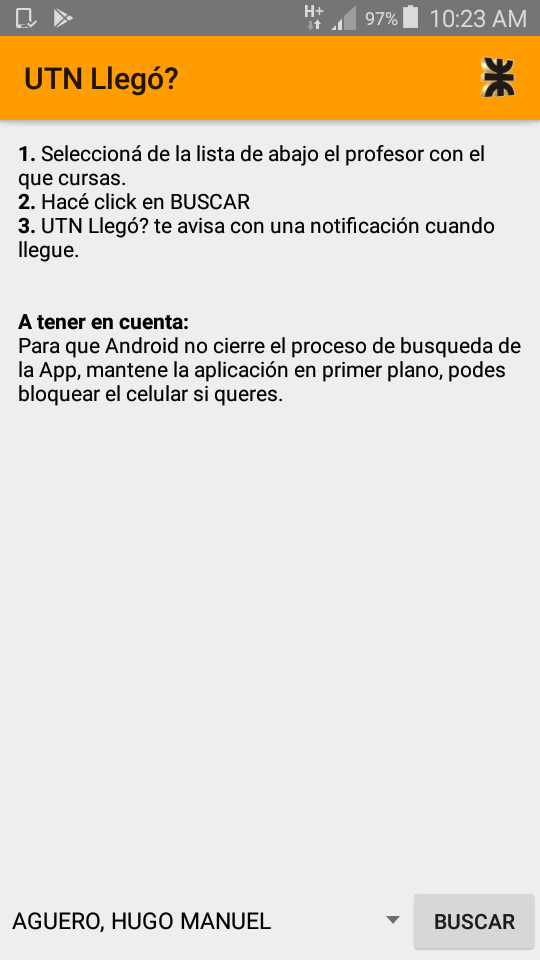
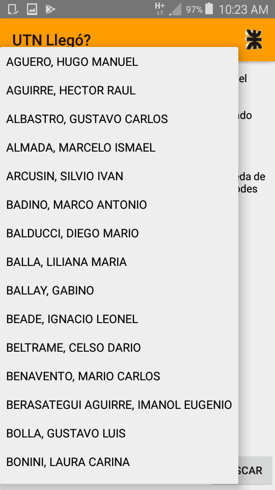
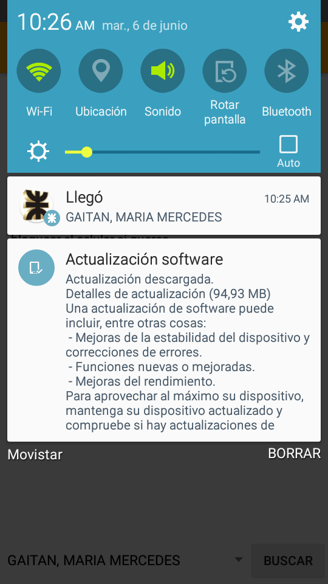

# UTN_Llegó?
Aplicación Android para la UTN FRP

"UTN Llegó?" es una aplicación móvil programada en Android Studio para la Universidad Tecnológica Nacional (Facultad Regional Paraná).
Tiene como función avisar mediante un ringtone la llegada de los profesores a la institución.

